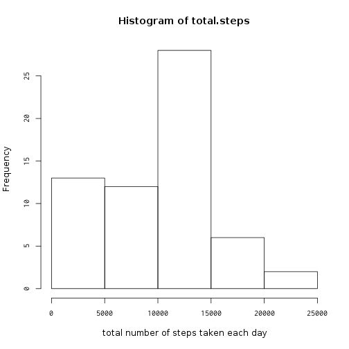
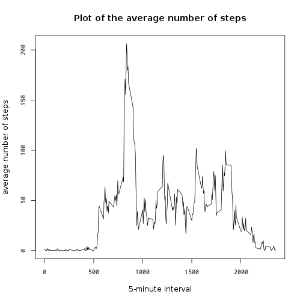
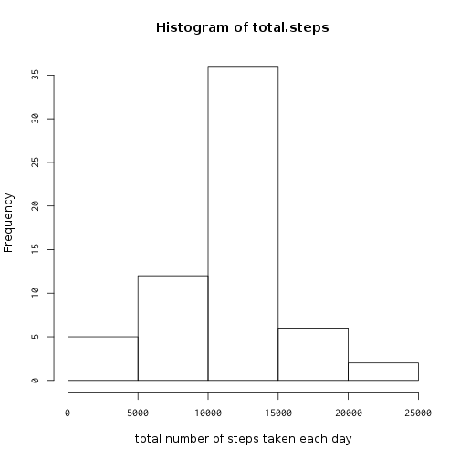
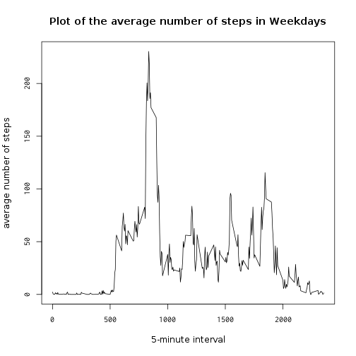
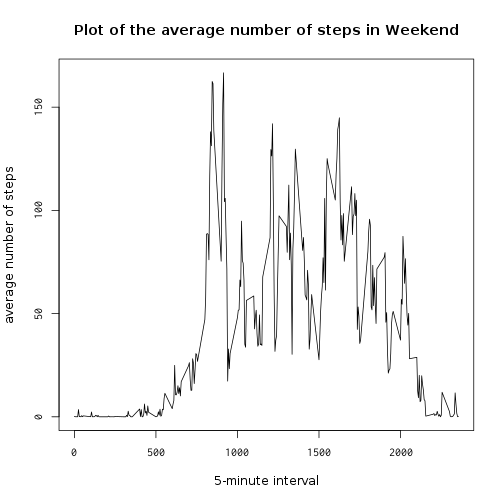

# Reproducible Research: Peer Assessment 1

## Loading and preprocessing the data


```r
unzip(zipfile="activity.zip")
data <- read.csv("activity.csv")
```

## What is mean total number of steps taken per day?
  This is a histogram that shows total number of steps taken each day.


```r
total.steps <- tapply(data$steps, data$date, sum, na.rm=TRUE)
hist(total.steps, xlab="total number of steps taken each day")
```

 

### mean


```r
mean(total.steps, na.rm=TRUE)
```

```
## [1] 9354.23
```

### median


```r
median(total.steps, na.rm=TRUE)
```

```
## [1] 10395
```

## What is the average daily activity pattern?
  Here is the average number of steps by 5-minute interval.


```r
averages <- tapply(data$steps, data$interval, mean, na.rm=TRUE)

plot (names(averages), averages, type="l",
      main="Plot of the average number of steps",
      xlab="5-minute interval",
      ylab="average number of steps")
```

 

The 5-minute interval which contains maximum number of steps is as
follows.


```r
as.numeric(names(which.max(averages)))
```

```
## [1] 835
```

## Imputing missing values

The total number of missing values in the dataset is,


```r
sum(is.na(data))
```

```
## [1] 2304
```

The strategy for filling in all of the missing values in the dataset
is,

 - use the mean for that 5-minute interval.

By using this strategy, I crate a new dataset with the missing data
filled in.


```r
dataNoNA <- data

for (i in which(is.na(dataNoNA))) {
    dataNoNA[i,1] <- averages[((i-1)%%288)+1]
}
```

### New Histogram

  This is a new  histogram that shows total number of steps taken each day.


```r
total.steps <- tapply(dataNoNA$steps, dataNoNA$date, sum, na.rm=TRUE)
hist(total.steps, xlab="total number of steps taken each day")
```

 

### mean


```r
mean(total.steps, na.rm=TRUE)
```

```
## [1] 10766.19
```

### median


```r
median(total.steps, na.rm=TRUE)
```

```
## [1] 10766.19
```

### analysis
- The value for mean in my new file is not the same in as the original.
- The median for my new file is the same as the original.

## Are there differences in activity patterns between weekdays and weekends?

To find the patterns, Let's create two new factor variables in the
dataset.

- weekday
- weekend


```r
weekend <- c("土曜日","日曜日")
dayWeek <- c()

for (i in 1:length(dataNoNA$steps)) {
    if (any(weekdays(as.Date(dataNoNA[i,2])) == weekend)) {
        dayWeek[i] <- "weekend"
    }
    else {
        dayWeek[i] <- "weekday"
    }
}

dataNoNA <- cbind(dataNoNA, dayWeek)
```

### Weekday vs weekend charts


```r
dataWd <- dataNoNA[dataNoNA$dayWeek == "weekday",]
dataWe <- dataNoNA[dataNoNA$dayWeek == "weekend",]

wdAverages <- tapply(dataWd$steps, dataWd$interval, mean)
weAverages <- tapply(dataWe$steps, dataWe$interval, mean)
```


```r
plot (names(wdAverages), wdAverages, type="l",
      main="Plot of the average number of steps in Weekdays",
      xlab="5-minute interval",
      ylab="average number of steps")
```

 


```r
plot (names(weAverages), weAverages, type="l",
      main="Plot of the average number of steps in Weekend",
      xlab="5-minute interval",
      ylab="average number of steps")
```

 
